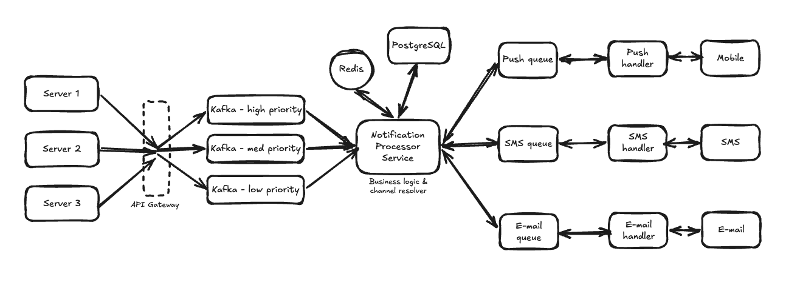

# Notification System

A distributed, event-driven notification platform capable of delivering notifications across multiple channels (Push, SMS and Email) while supporting high availability, low latency and horizontal scalability.

---

# 1. Requirements

## Functional Requirements

- Send notifications via:
  - Push Notifications
  - SMS
  - Email
- Support multiple delivery channels for a single notification.
- Accept notification requests from internal services.
- Resolve the final delivery channels based on business policies and user preferences.
- Support notification expiry (TTL).
- Support both transactional and marketing notifications.
- Retry failed notifications within the allowed notification lifetime.

## Non-Functional Requirements

- High Availability over Strong Consistency.
- Low latency:
  - OTP / Password Reset: **< 5 seconds**
  - Other notifications: within a few seconds.
- Horizontally scalable.
- Minimise duplicate notifications.
- Fault isolation between notification channels.

---

# 2. Core Entities

## NotificationRequest

```json
{
  "recipient_id": "usr_123",
  "priority": "HIGH",
  "template_id": "otp_verification_v1",
  "variables": {
    "code": "123456",
    "expires_in_mins": 5
  },
  "requested_channels": [
    "PUSH",
    "SMS"
  ],
  "ttl_seconds": 300,
  "idempotency_key": "req_abc123"
}
```

### Fields

| Field | Description |
|--------|-------------|
| recipient_id | Target user |
| priority | Processing priority (HIGH / MEDIUM / LOW) |
| template_id | Notification template identifier |
| variables | Template variables |
| requested_channels | Suggested delivery channels |
| ttl_seconds | Notification expiry |
| idempotency_key | Prevent duplicate processing |

---

# 3. APIs

## Send Transactional Notification

```
POST /v1/notifications/send
```

Request body:

```json
{
  "recipient_id": "usr_123",
  "priority": "HIGH",
  "template_id": "otp_verification_v1",
  "variables": {
    "code": "123456",
    "expires_in_mins": 5
  },
  "requested_channels": [
    "PUSH",
    "SMS"
  ],
  "ttl_seconds": 300,
  "idempotency_key": "req_abc123"
}
```

---

## Send Bulk Notification

```
POST /v1/notifications/bulk-send
```

Request structure follows the same contract as the transactional API.

---

# 4. High-Level Design

## Architecture



## Multi-Channel Fan-out

A single notification request may target multiple delivery channels.

For example:

```
Notification Request
        │
        ▼
Requested Channels
 ├── Push
 ├── SMS
 └── Email
```

After validating TTL, evaluating user preferences, and resolving delivery policies, the Notification Processor creates **one independent message per target channel**.

```
Notification Processor
        │
        ├──────────────┐
        │              │
        ▼              ▼
 Push Queue       SMS Queue
        │              │
        ▼              ▼
 Push Handler     SMS Handler
```

For a notification requiring **Push + SMS**, two independent downstream jobs are published:

- One message to the Push Queue.
- One message to the SMS Queue.

Each channel is processed independently, providing:

- Fault isolation (SMS failures do not impact Push or Email).
- Independent retries per channel.
- Independent horizontal scaling.
- Parallel delivery for latency-sensitive notifications.

---


## Processing Flow

1. Internal services submit notification requests.
2. Requests are routed into Kafka based on priority.
3. Notification Processor consumes Kafka messages.
4. Expired notifications are discarded.
5. User preferences and notification policies are fetched from Redis (cache-aside with PostgreSQL).
6. Final delivery channels are resolved.
7. Templates are rendered.
8. The Notification Processor emits one message per resolved delivery channel.
9. Messages are published to the corresponding channel queues.
10. Dedicated channel handlers consume the queues and communicate with external providers.

---

# 5. Data Model

## PostgreSQL

PostgreSQL acts as the **source of truth** for persistent notification metadata and user preferences.

### user_preferences

Stores notification preferences configured by users.

| Column | Type | Description |
|--------|------|-------------|
| user_id | BIGINT (PK) | User identifier |
| push_enabled | BOOLEAN | Push notifications enabled |
| sms_enabled | BOOLEAN | SMS notifications enabled |
| email_enabled | BOOLEAN | Email notifications enabled |
| updated_at | TIMESTAMP | Last preference update |

---

### notification_events

Stores metadata for accepted notification requests.

| Column | Type | Description |
|--------|------|-------------|
| notification_id | UUID (PK) | Unique notification identifier |
| recipient_id | BIGINT | Target user |
| priority | ENUM | HIGH / MEDIUM / LOW |
| template_id | VARCHAR | Notification template |
| ttl_seconds | INT | Notification expiry |
| status | ENUM | Pending / Processing / Completed / Failed |
| created_at | TIMESTAMP | Request creation time |

---

### Scaling Strategy

- Sharded by **recipient_id (user ID)**.
- Read replicas serve read-heavy workloads.
- Primary handles writes.

---

## Redis

Redis acts as a **cache** using the Cache-Aside pattern.

### User Preferences

```
pref:{userId}
```

Stores cached notification preferences.

---

### Notification Templates

```
template:{templateId}
```

Stores compiled notification templates to reduce database lookups.

---

### Idempotency Keys

```
idem:{idempotencyKey}
```

Value

```
notification_id
```

TTL

```
Notification TTL (or configured retention period)
```

Used to detect duplicate notification requests during retries.

---

### Cache Strategy

1. Read Redis.
2. On cache miss, fetch from PostgreSQL.
3. Populate Redis.
4. Return result.

---

# 6. Deep Dives

## Priority-based Processing

Kafka topics are separated by priority.

- High
- Medium
- Low

Priority influences:

- Retry strategy
- Processing latency

---

## Notification Processing

Notification Processor performs:

- TTL validation
- Cache lookup
- Policy evaluation
- Channel resolution
- Provider selection
- Template rendering
- Publishing to downstream channel queues

---

## Channel Isolation

Each delivery channel has its own queue and handler.

Benefits:

- Independent scaling
- Fault isolation
- Cleaner separation of responsibilities

A slow SMS provider does not block Email or Push notifications.

---

## Provider Failover

Provider health is considered before dispatch.

Circuit breakers can prevent traffic from being routed to unhealthy providers.

Multiple providers can be configured for failover.

---

## Reliability

Retry strategy:

- Retry transient failures
- Use exponential backoff with jitter
- Respect notification TTL

Kafka offsets are committed only after downstream channel messages have been successfully acknowledged.

If a worker fails before committing, another consumer can reprocess the Kafka message.

Idempotency keys help reduce duplicate processing.

---

# 7. Tradeoffs

## High Availability over Consistency

Chosen because delayed notifications are preferable to rejecting notification requests.

---

## Asynchronous Processing

Pros

- Decouples producers from consumers
- Smooths traffic spikes
- Improves scalability

Cons

- Eventual consistency
- Retry handling becomes more complex

---

## Redis Cache

Pros

- Low latency
- Reduces database load

Cons

- Cache invalidation complexity
- Additional operational overhead

---

## Priority Queues

Pros

- Prevents low-priority traffic from delaying critical notifications
- Independent scaling

Cons

- More infrastructure to operate
- Additional routing logic

---

# 8. Future Improvements

- Dead Letter Queues (DLQs) for permanently failed notifications.
- Dedicated fan-out service for very large recipient groups.
- More robust handling of partial failures during downstream queue publication.
- Stronger ordering guarantees for notifications that require ordered delivery.
- Improved provider health management using shared health information.
- Operational dashboards for queue lag, retry rates and delivery latency.