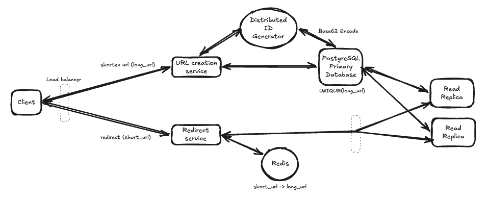

# URL Shortener ([Bit.ly](http://Bit.ly))

## Overview

This document presents the high-level design of a globally distributed URL shortening service similar to Bit.ly.

The service allows users to:

- Generate short URLs from long URLs
- Redirect users from a short URL to its original destination

The design prioritizes:

- Low latency
- High availability
- Horizontal scalability
- Simplicity of lookups

Multi-region deployment and advanced analytics are discussed under Production Improvements.
---

# Functional Requirements

- Generate a unique short URL for a given long URL
- Redirect users from a short URL to the original URL
- Return the same short URL if the same long URL is shortened multiple times
- Optional support for:
  - Custom aliases
  - Expiration time

---


# Non Functional Requirements

- Low latency (<100ms)
- High availability
- Horizontally scalable
- Globally unique short URLs
- Eventual consistency is acceptable
- Read-heavy workload (~10:1)

---


# Capacity Estimation

Assumptions

- 100 Million URL creations/month
- 1 Billion redirects/month
- Average URL size = 500 Bytes

Average traffic

- Writes ≈ 38/sec
- Reads ≈ 385/sec

Peak traffic

- Writes ≈ 100/sec
- Reads ≈ 1000/sec

Storage

```
100 Million × 500 Bytes
≈ 50 GB/month

≈ 600 GB/year
```

This comfortably fits inside a relational database initially.

---


# Core Entities

| Entity | Description |
|---------|-------------|
| Short URL | Base62 encoded unique identifier. |
| Long URL | Original destination URL. |
| Expiration | Optional expiry timestamp. |
| Alias | Optional custom short code supplied by the user. |


# APIs


## Create Short URL

POST /urls

Request

```json
{
    "long_url": "https://example.com/page",
    "alias": "optional"
}
```

Response

```json
{
    "short_url": "https://sho.rt/aB91xY",
    "expires_at": "optional"
}
```

---


## Redirect

GET /{short_url}

Response

```
HTTP 301

Location:
https://example.com/page
```


### 301 vs 302

| 301 | 302 |
|------|------|
| Permanent redirect | Temporary redirect |
| Browser/CDN caching | Less aggressive caching |
| Lower latency | Easier destination updates |

The design assumes 301 redirects for maximum performance. If URL destinations are expected to change frequently or redirect analytics require every request to reach the service, 302/307 redirects may be more appropriate.


---


# High Level Architecture




The architecture separates write and read responsibilities.

- URL Creation Service handles shortening requests.
- Redirect Service serves read traffic.
- PostgreSQL Primary handles writes.
- Read Replicas handle redirect queries.
- Redis caches frequently accessed mappings.
- Distributed ID Generator creates globally unique IDs.
---


# Request Flow


## URL Creation

Client

↓

Write API

↓

Check if URL already exists

↓

If yes

Return existing short URL

↓

Else

Generate new ID

↓

Base62 encode

↓

Persist

↓

Return short URL

---


## Redirect

Client

↓

Redirect API

↓

Redis Lookup

↓

Cache Hit

↓

301 Redirect

or

Cache Miss

↓

Read replica Lookup

↓

Populate Cache

↓

301 Redirect

---


# ID Generation

Requirements

- Globally unique
- Low latency
- Horizontally scalable
- Collision-free

## Options Considered

### Random IDs

Pros

- Hard to predict

Cons

- Collision detection required

### Incrementing Counter

Pros

- Simple

Cons

- Single bottleneck

### Distributed ID Generator (Chosen)

Pros

- Collision-free
- Horizontally scalable
- Works across regions

Generated IDs are Base62 encoded before storage.

---


# Cache Strategy

Cache Aside

Redis stores

```
short_url

↓

long_url
```

Flow

Read

↓

Redis

↓

Database (on miss)

↓

Populate cache

LRU eviction is used.

---


# Database

Relational Database (PostgreSQL)

Reasons

- Simple key-value lookups
- Strong consistency for writes
- Secondary indexes
- ACID transactions
- Easy operational model

Schema

```
CREATE TABLE urls (
    short_url VARCHAR(10) PRIMARY KEY,
    long_url TEXT NOT NULL,
    created_at TIMESTAMP,
    expires_at TIMESTAMP NULL,
    UNIQUE (long_url)
);
```

Indexes

- Primary Key(short_url)
- Unique(long_url)

---


### Handling Concurrent Requests

Two concurrent requests may attempt to shorten the same URL simultaneously.

The database enforces:

- UNIQUE(long_url)

If the insert fails because another request already created the mapping, the service simply queries the existing row and returns its short URL.


# Scaling Decisions


## Stateless API Servers

Application servers remain stateless.

Easy horizontal scaling.

---


## Database Replication

Primary

↓

Read Replicas

Reads are distributed across replicas.

---


## Redis

Frequently accessed URLs stay in memory.

Most redirects avoid database access.

---


## Global Deployment

Multiple regions

Each region contains

- Redirect servers
- Redis cache
- Read replicas

GeoDNS routes users to the nearest region.

---


# Tradeoffs


## PostgreSQL vs NoSQL

Chosen

- Simpler operational model
- Strong consistency
- Secondary indexes

Rejected

- Cassandra
- DynamoDB

Reason

Current workload does not require extreme write throughput.

---


## Deterministic URLs

Chosen

Same long URL returns same short URL.

Pros

- No duplicate storage
- Better UX

Cons

Requires duplicate detection.

---


## Eventual Consistency

Accepted

Read replicas may briefly lag after writes.

Benefits

- Better availability
- Better read scalability

---


# Failure Scenarios


## Redis Failure

Fallback

↓

Database

Higher latency but service remains available.

---


## Replica Failure

Traffic routed to remaining replicas.

---


## Primary Database Failure

Failover to standby primary.

---


## Cache Stampede

Multiple requests may simultaneously miss cache.

Mitigation

Request coalescing / distributed locks.

---


# Production Improvements

- Bloom Filter for invalid URLs
- CDN for global redirects
- Analytics pipeline
- Custom domains
- Abuse detection
- Safe Browsing integration
- Rate limiting
- TTL support
- Background cleanup
- Metrics & monitoring
- Distributed tracing
- Snowflake-style distributed ID generation
- Multi-region active-active deployment

---


# Interview Discussion Points


## Why relational database?

Simple indexed lookups.

---


## Why Redis?

Most traffic consists of redirects.

---


## Why cache only short → long?

Read-heavy workload.

---


## Why eventual consistency?

Reads dominate writes.

---


## How are duplicate URLs prevented?

Unique constraint on long_url together with transactional inserts.

---


## How would this scale globally?

- GeoDNS
- Regional caches
- Read replicas
- Distributed ID generation

---


# Future Extensions

- User accounts
- URL analytics
- QR code generation
- Password-protected links
- Expiring links
- Branded domains
- API keys
- Rate limiting
- Premium plans

